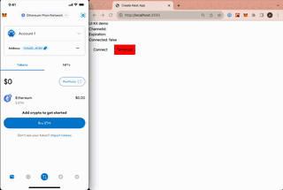
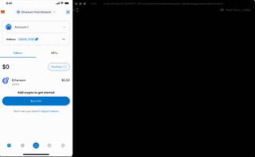

# MetaMask SDK

The MetaMask SDK enables developers to easily connect their dapps with a MetaMask wallet (Extension or Mobile) no matter the dapp environment or platform.

The MetaMask SDK is a library that can be installed by developers on their projects and will automatically guide their users to easily connect with a MetaMask wallet client. For instance, for dapps running on a desktop browser, the SDK will check if Extension is installed and if not it will prompt the user to install it or to connect via QR code with their MetaMask Mobile wallet. Another example, for native mobile applications, the SDK will automatically deeplink into MetaMask Mobile wallet to make the connection.

The MetaMask SDK instance returns a provider, this provider is the `ethereum` object that developers are already used to which is [here](https://docs.metamask.io/guide/ethereum-provider.html). This provider will now be available for:

- [Javascript-based apps](https://c0f4f41c-2f55-4863-921b-sdk-docs.github.io/guide/metamask-sdk-js.html#javascript)
  - [Web (d)apps](https://c0f4f41c-2f55-4863-921b-sdk-docs.github.io/guide/metamask-sdk-js.html#web-d-apps)
  - [React Native](https://c0f4f41c-2f55-4863-921b-sdk-docs.github.io/guide/metamask-sdk-js.html#react-native)
  - [Electron](https://c0f4f41c-2f55-4863-921b-sdk-docs.github.io/guide/metamask-sdk-js.html#electron)
  - [NodeJS](https://c0f4f41c-2f55-4863-921b-sdk-docs.github.io/guide/metamask-sdk-js.html#nodejs)
- [Gaming](https://c0f4f41c-2f55-4863-921b-sdk-docs.github.io/guide/metamask-sdk-gaming.html#gaming)
  - [Unity](https://c0f4f41c-2f55-4863-921b-sdk-docs.github.io/guide/metamask-sdk-gaming.html#unity)
  - [Unreal Engine](https://c0f4f41c-2f55-4863-921b-sdk-docs.github.io/guide/metamask-sdk-gaming.html#unreal-engine)
- [Mobile Native Apps](https://c0f4f41c-2f55-4863-921b-sdk-docs.github.io/guide/metamask-sdk-mobile.html#mobile)
  - [Android](https://c0f4f41c-2f55-4863-921b-sdk-docs.github.io/guide/metamask-sdk-mobile.html#android)
  - [iOS](https://c0f4f41c-2f55-4863-921b-sdk-docs.github.io/guide/metamask-sdk-mobile.html#ios)

## Features
- Session persistence
- Multi Provider (Let user choose between browser extension and mobile wallet)
- Wagmi Hook Integration (alpha)
- i18n throuhg Modal customization
- smart contract library ( upcoming )

# Getting Started

The following code examplifies importing the SDK into a javascript-based app. For other languages, check the sections bellow.

Install the SDK:

```bash
yarn add @metamask/sdk
or
npm i @metamask/sdk
```

## Web (d)apps


Follow example on:
 - [nextjs demo](./packages/examples/nextjs-demo/README.md)
 - [react demo](./packages/examples/create-react-app/README.md)

## React Native

Follow example on:
 - [react native demo](./packages/examples/reactNativeDemo/README.md)

## NodeJS

```ts
import { MetaMaskSDK } from '@metamask/sdk';
const MMSDK = new MetaMaskSDK({
  dappMetadata: {
    name: 'NodeJS example',
  }
});
MMSDK.connect()
  .then((accounts) => {
    console.log('MetaMask SDK is connected', accounts);
    const ethereum = MMSDK.getProvider();
    const ethereum = sdk.getProvider();
    const balance = await ethereum.request({
      method: 'eth_getBalance',
      params: accounts,
    });

    console.debug(`account balance`, balance);
  })
  .catch((error) => {
    console.error(error);
  });
```

 - [nodejs example](./packages/examples/nodejs/README.md)

## SDK Options

You can find the full interface in [sdk.ts](./packages/sdk/src/sdk.ts) file but here are the useful options:

- `checkInstallationImmediately`: boolean (default: false) - If true, the SDK will check if MetaMask is installed on the user's browser and send a connection request. If not it will prompt the user to install it. If false, the SDK will wait for the `connect` method to be called to check if MetaMask is installed.

- `useDeeplink`: boolean (default: false) - If true, the SDK will use deeplinks to connect with MetaMask Mobile. If false, the SDK will use universal links to connect with MetaMask Mobile.

- `shouldShimWeb3`: boolean (default: false) - If true, the SDK will shim the `window.web3` object with the provider returned by the SDK (useful for compatibility with older browser).

- `enableDebug`: boolean (default: true) - Send anonymous analytics to MetaMask to help us improve the SDK.

- `modals`: see nodejs example to customize or translate each of the displayed modals.

## Contributing

Please see our [contributing guidelines](./docs/CONTRIBUTING.md) for more information.
