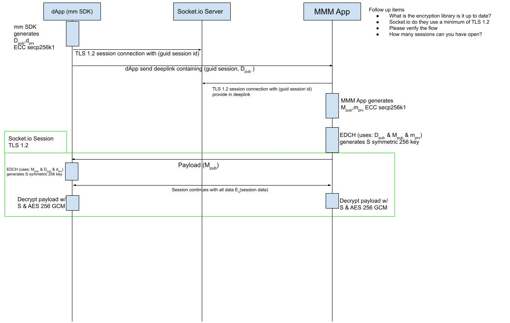

# MetaMask SDK

The MetaMask SDK enables developers to easily connect their dapps with a MetaMask wallet (Extension or Mobile) no matter the dapp environment or platform.

Although users can straightforwardly access dapps within a desktop browser with MetaMask Extension installed and can also straightforwardly access dapps within our in-app browser inside MetaMask Mobile, it has been historically harder for native mobile apps, native desktop apps, games, and even web apps on mobile browsers to connect with a MetaMask wallet.

The MetaMask SDK is a library that can be installed by developers on their projects and will automatically guide their users to easily connect with a MetaMask wallet client. For instance, for dapps running on a desktop browser, the SDK will check if Extension is installed and if not it will prompt the user to install it or to connect via QR code with their MetaMask Mobile wallet. Another example, for native mobile applications, the SDK will automatically deeplink into MetaMask Mobile wallet to make the connection.

The MetaMask SDK instance returns a provider, this provider is the ```ethererum``` object that developers are already used to which is [here](https://docs.metamask.io/guide/ethereum-provider.html). This provider will now be available for:
- [Javascript-based apps](#javascript-based-apps)
  - [Web (d)apps](#web)
  - [React Native](#react-native)
  - [Electron](#electron)
  - [NodeJS](#nodejs)
- [Games](#games) 
  - [Unity](#unity)
  - [Unreal Engine](#unreal-engine)
- [Mobile Native Apps](#mobile)
  - [Android](#android)
  - [iOS](#ios)

# Getting Started

The following code examplifies importing the SDK into a javascript-based app. For other languages, check the sections bellow.

Install the SDK:
```
yarn add @metamask/sdk
or
npm i @metamask/sdk
```

Import the SDK (for possible parameters check this):
```
import MetaMaskSDK from '@metamask/sdk'
const ethereum = new MetaMaskSDK({})
```

Use the SDK:
```
ethereum.request({method: 'eth_requestAccounts', params: []})
```

## Javascript-based apps

Install the SDK:
```
yarn add @metamask/sdk
or
npm i @metamask/sdk
```

Import the SDK (for possible parameters check this):
```
import MetaMaskSDK from '@metamask/sdk'
const ethereum = new MetaMaskSDK({ params })
```

For a list of possible `params` check the following table:

| Param name                     | Type                            | Default value        | Description           |
| ------------------------------ |:-------------------------------:|:--------------------:|:---------------------:|
| `injectProvider`               | `boolean`                       | `true`               | Whether to inject the provider on the window object, it won't inject for nodeJS or React Native as window object is not available |              
| `forceInjectProvider`          | `boolean`                       | `false`              | Forces injection of provider even if another provider is already present on the window object |
| `forceDeleteProvider`          | `boolean`                       | `false`              | Forces the deletion of a provider that exists on window |
| `checkInstallationImmediately` | `boolean`                       | `false`              | The SDK normally checks if MetaMask is installed once a call to `eth_requestAccounts` is made, but if `checkInstallationImmediately` it will check before any call is made |
| `checkInstallationOnAllCalls`  | `boolean`                       | `false`              | Installation is normally checked once a call to `eth_requestAccounts` is made, but if `checkInstallationOnAllCalls` is `true` then it will check on all calls |
| `shouldShimWeb3`               | `boolean`                       | `true`               | If `window.web3` should be shimmed for legacy compatibility purposes, for reference check [here](https://docs.metamask.io/guide/provider-migration.html#replacing-window-web3) |
| `preferDesktop`                | `boolean`                       | `false`              | If a web dapp is running on a desktop browser and MetaMask Extension is not installed, the SDK normally gives the option for the user to connect with their MetaMask Mobile wallet by scanning a QR code. If `preferDesktop` is `true`, then the option to connect with Mobile is not offered and it will automatically guide the user to install MetaMask Extension. |
| `openDeeplink`                 | `(deeplinkUrl: string) => void` | `undefined`          | Different platforms have different ways of opening deeplinks, for example, on web we do `window.open`, but on React Native we do `Linking.open`, this function receives the deeplink url and gives the developers a chance to customize how to best open it |
| `communicationLayerPreference` | `"socket" or "webrtc" : string` | `socket`             | What type of communication library should the dapp and MetaMask wallet use to communicate between each other, you can choose socket or webrtc. Waku is coming soon. |
| `webRTCLib`                    | `WebRTC Lib`                    | `undefined`          | WebRTC doesn't come installed on the SDK by default, so you need to install it on your project first. Check the React Native section to see how to do this. |
| `WalletConnectInstance`        | `WalletConnect Lib`             | `false`              | WalletConnect is another way of connecting your dapp to MetaMask wallet but it doesn't come installed by default, check here on how to install it |
| `forceRestartWalletConnect`    | `boolean`                       | `false`              | If you are using WalletConnect, sometimes it's useful to kill the previous WC session and start another one. To do that set `forceRestartWalletConnect` to true |


### Web

### React Native

### Electron

### NodeJS

## Games
### Unity
### Unreal Engine
Coming soon

## Mobile
### Android
Coming soon
### iOS
Coming soon
### React Native
Check [here](#react-native)

# Concepts
## Communication Layer
### Security

The security layer is handled via an `AES-256-GCM` symmetric encryption which is generated by using an initial **Elliptic-curve Diffie–Hellman** key exchange. This allows the secure generation of the **common symmetric key** that is then used to encrypt every message sent/received between the two sides.

Assuming a `dApp` and a user with `MetaMask Mobile app` (`MMM app`) installed, the steps are the following:

1. `dApp` - generates ECDH `Dpub` dpriv keys
2. `dApp` - sends deeplink containing `session uuid` + `Dpub`
3. `MMM app` - establishes connection on `session uuid` "channel" (not encrypted)
4. `MMM app` - generates ECDH `Mpub` `mpriv` keys
5. `MMM app` - uses `Dpub` to calculate the `simmetric key`
6. `MMM app` - sends `Mpub` to dApp via `session guid` "channel" (not encrypted)
7. `dApp` - receives `Mpub` and calculates the `symmetric key`
8. From now on, `dApp` and `MMM app` can use the same calculated `symmetric key` with `AES-256-GCM` to encrypt everything is passed on `session uuid` "channel"

&nbsp;  

&nbsp;

Thanks to ECDH algorithm the `symmetric key` calculated by `MMM app` (using `Mpriv`, `mpub`, `dpub`) is the same as the one calculated by `dApp` (using `Dpriv`, `dpub`, `mpub`).

A third malicious user listening to the exchange of the two public keys (`mpub` and `dpub`) is not able to calculate `dApp-MMM app` symmetric key as its value also depends on the two private keys (`Mpriv` and `Dpriv`).
